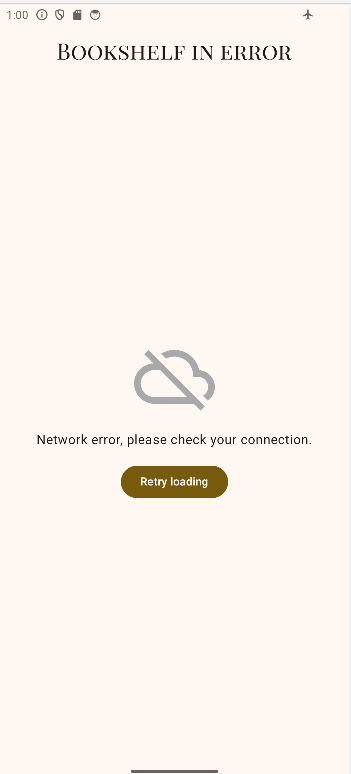

# 📚 **Bookshelf**
**Bookshelf** is a modern Android application that allows users to search and display a list of books with their images using the Google Books API. The project follows Android development best practices, implementing the MVVM architecture and leveraging tools such as Retrofit, Gson, and Coroutines for efficient network calls and data processing.

## ✅ **LAST MAJOR UPDATES**
   - Made Unit tests for the ViewModel and the Repository
      - created fake data ,fake repository and fake API service for unit testing.
   - Deployed Signed APK for install the application in release mode.

## ❌ **NEXT UPDATES**
   - This project is now finish.

## 📋 **Features**
   - 📚 Display a list of books :

      - ✅ **DONE** Fetch and display a list of books from the Google Books API.
      - ✅ **DONE** Show book details including title, author, and image and some additional information.

   - 🎨 **Modern and Fluid Interface**:

      - TopBar:
         - ✅ **DONE** Display application title.
         - ✅ **DONE** Allow searching for books.
         - ✅ **DONE** Implement dynamic UI behaviors.

      - Light/Dark Mode:
         - ✅ **DONE** Fully supports Material 3 with adaptive light and dark themes.

   - 🔄 **Real-time status management**:

      - ✅ **DONE** Use a ViewModel to handle API responses and manage UI state.
      - ✅ **DONE** Implement StateFlow for reactive updates.

   - 🚀 Performance and responsiveness:
   
      - ✅ **DONE** Implement lazy loading for efficient image handling.
      - ✅ **DONE** Use Coil for optimized image fetching.
      - ✅ **DONE** Optimize UI scrolling and animations.
      
   - 🛠 Error Handling & User Feedback:

      - ✅ **DONE** Displays appropriate error messages.
      - ✅ **DONE** Provides loading indicators for better UX.
      - ✅ **DONE** UI instrumented tests.
      - ✅ **DONE** ViewModel and Repository tests.

## 🛠️ **Tech Stack**
   - **Kotlin**: Modern, concise language for Android development.
   - **Jetpack Compose**: Declarative UI toolkit for Android.
   - **Material 3**: Modern, accessible user interface.
   - **StateFlow**: Reactive state management for real-time updates.
   - **ViewModel**: MVVM architecture to separate business logic from user interface.
   - **Retrofit**: Make network call to API REST.
   - **State Management**: Handle states with MutableStateOf.
   - **Coil**: Download, buffer, decode and cache images
   - **Gson**: Parse JSON responses.
   - **Google Books API** : Use this API for retrieve books from internet.
   - **JUnit 4/5**: Write and run unit tests.
   - **Turbine**: Test Kotlin Flow and StateFlow emissions.
   - **Kotlin Coroutines Test**: Control coroutine dispatchers during tests.
   - **Mock implementations**: Fake repository and data sources to simulate different states (success, error).
   - **Compose Testing**: Instrumentation tests for Compose UI using AndroidComposeTestRule.
   - **Test Rules**: Custom rules like TestDispatcherRule to control coroutine dispatchers in tests.
   - **Test Tags & String Res Helpers**: Extension functions to simplify Compose test node selection.
   
## 🚀 **How to Use**
1. **Launch the App**:
   - Download the "app-release.apk" file find in \app\release\ .
   - Install the file in your smartphone or in an emulator. (Good performance because in Release Build Variant)
   - If you want to use android studio, download the code and launch the app on an Android device or emulator. (Bad performance because in Debug Build Variant)
2. **Use Google Book API on the InitialScreen**:
   - Read the welcoming message.
   - Tap the keywords of your choice in the text field and validate to launch the API request to display a list of books from Google Book.
3. **Navigate on the Google Books list**:
   - Scroll through the grid of books to explore them.
4. **Click on a book into the grid**:
   - Click on a book image of the books list to go to the book details.
5. **Scroll in the detail page to read all the book details:
   - Scroll vertically to see all the book details.
   - Scroll horizontally in the three specifics cells to see specific details of the book.
6. **Use the link to go to the book page in Google Book internet site**:
   - Use the link in the end of the detail page to go to Google Book internet site.
7. **Return on the Home Screen**:
   - click on the TopBar BackArrow or the AndroidBackButton to come back to HomeScreen.
   - Choose other book on the list or write new keywords to display new books list.

## 📸 **Screenshots**

- **Initial screen**:

   
   
- **Home screen**:

   

- **Error screen**:

   

- **Details screen**:

   
   

## 🤝 **Contributions**
Contributions are welcome! Feel free to fork the repository and submit a pull request for new features or bug fixes✅🟩❌.